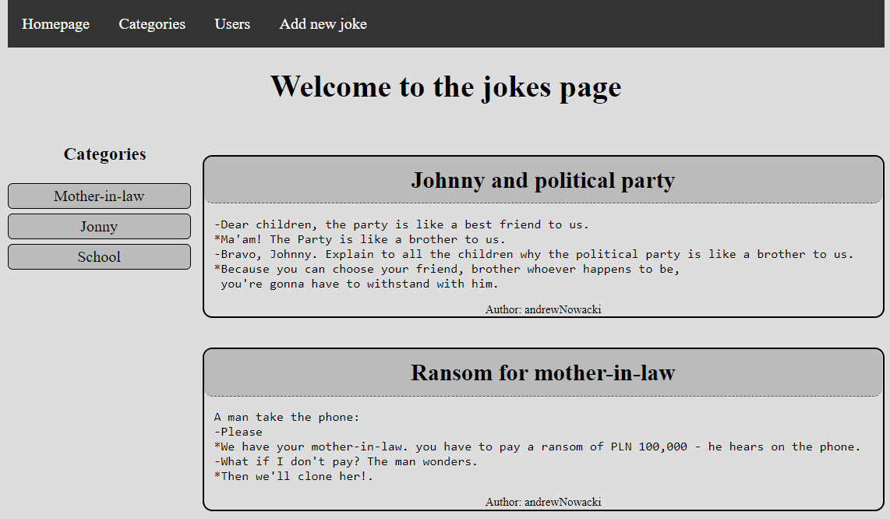
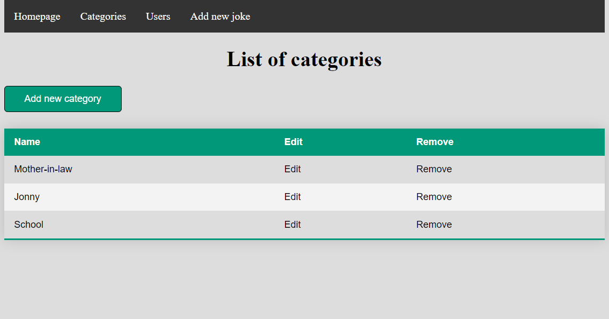
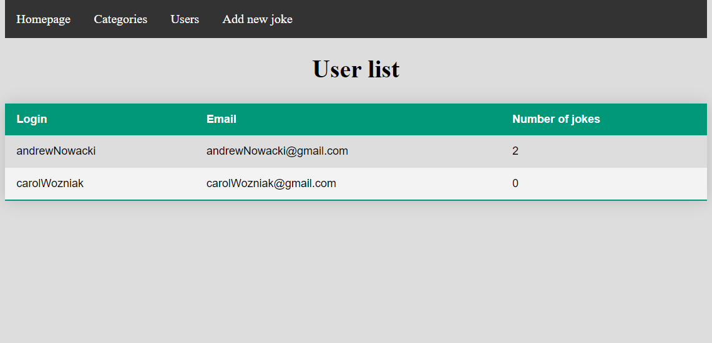

# Jokes Web App

## General Information
An application that allows users to view and add jokes in the appropriate categories.

## Screenshots

### Main page

### List of categories

### List of users

### Form add joke

## Technologies Used
- Java
- Spring
- Mockito
- JUnit
- Hibernate
- H2
- CSS
- HTML

## Features
- page with jokes (title, content, author)
- buttons with all categories jokes
- form add joke
- page with list of users and numbers of jokes
- page with list of categories
- bar with navigation buttons

### Functions of Web
- add a new jokes to web page
- add a new category to web page
- sorting jokes by categories
- display list of all users
- display list of all categories
- delete and edition each of one categories

## Usage
Run main method in JokesWebAppApplication class 
and enter "localhost:8080" to browser window.

## Room for Improvement

- registration users and profiles